## Welcome to ICS491Lucio - OHA Website

<a href="http://uhpool.meteorapp.com/"><i class="large github icon"></i>OHA website</a>

# Table of contents

* [Overview: OHA website](#overview-OHA-Website)
  * [Walkthrough for OHA website](#walkthrough-OHA-Website)
* [Installation](#installation)
  * [Branches](#branches)
  * [Heroku Website](#heroku-website)
* [Application design](#application-design)
  * [Directory structure](#directory-structure)
  * [Import conventions](#import-conventions)
  * [Naming conventions](#naming-conventions)
  * [Data model](#data-model)
  * [CSS](#css)
  * [Routing](#routing)
  * [Authentication](#authentication)
  * [Authorization](#authorization)
  * [Configuration](#configuration)
  * [Redeploy Heroku](#redeploy-heroku)
  * [Survey](#survey)
* [Development history](#development-history)
  * [Initial Mockup Pages](#initial-mockup-pages)
  * [HACC 2017](#HAAC-2017)
  * [Milestone 1](#milestone-1)
  * [Milestone 2](#milestone-2)
  * [Intial User Study](#initial-user-study)
  * [Conclusion](#conclusion)

### Overview OHA Website

### Walkthrough OHA Website

Access the website through: http://uhpool.meteorapp.com/

UHPool is a meteor app that allows people to find other carpoolers in the UH community. 
When first accessing UHPool, everyone will be greeted by the landing page showing why they should join to use the app and images that show a preview of the app. It explains "why you should carpool?" and "why you should use this app?". The login button will direct a link to a UH login page, login using your UH Manoa account. 

Landing Page:


Login Page:


After logging in, inexperienced users will have to put in their personal information so enter your full name, a picture of yourself, picture of your car, type of vehicle, capacity limit of your car, location (area) where you want to be picked up, and a short biography about yourself. 

Edit Profile:


The profile page reflects the information you input from the edit profile page, it also shows an example what people will see when they click on your profile and what you'll see when clicking on other people’s profile page. 

Profile Page:


The listing page will show other users on the app that are also looking for other carpoolers. In this page, you can search for a driver or passenger at certain time periods that fit your schedule. By matching the day, time and area you can then click accept to send the user a notice that you're interested in carpooling with them. 

Listing page:


Your own listing page that to set up the time and dates when you are available to carpool with someone. Enter in your pickup location, drop off location, day, pickup time and drop-off time. So, if you want to carpool for 5 days then you should have 5 lines. It will then be posted on the listing page where other people can accept it.

My Listing Page:


### Installation

First, [install Meteor](https://www.meteor.com/install).

Second, [download a copy of UHPool](https://github.com/uhpool/uhpool.github.io/zipball/master), or clone it using git.
  
Third, cd into the app/ directory and install libraries with:

```
$ meteor npm install
```

Fourth, run the system with:

before using this code make sure that your package.json file contains this code:

```
{
  "name": "uhpool",
  "private": true,
  "scripts": {
    "start": "meteor --no-release-check --settings ../config/settings.json",
    "develop": "meteor --no-release-check --settings ../config/settings.development.json",
    "lint": "eslint ./imports",
    "jsdoc": "./node_modules/.bin/jsdoc -c ./jsdoc.json -r .",
    "test-watch": "meteor test --driver-package practicalmeteor:mocha --port 3100",
    "deploy": "DEPLOY_HOSTNAME=galaxy.meteor.com meteor deploy uhpool.meteorapp.com --owner ics314s17 --settings ../config/settings.json"
  }
```

This gives a shortcut for the command line into:

```
$ meteor npm run start
```

which is preferable to type than:

```
meteor --no-release-check --settings ../config/settings.json",
```

If all goes well, the application will appear at [http://localhost:3000](http://localhost:3000). If you have an account on the UH test CAS server, you can login.  

### Branches

When creating a new branch for the project use issue-XX naming conventions. This prevents people from working on the master branch to prevent any future issues. Each issue is to work on different issues or problems that require attention such as "working on the landing page".

```
$ git checkout -b issue-XX
```

Try to avoid using the master branch as it is the primary focus that the app will run on.

To change branches:

```
$ git checkout [issue-XX or master]
```

Make sure to do:

```
$ git pull
```

in the master branch before adding or pushing any code to github. This prevents stepping on peoples toes or overriding other people’s codes that they worked on earlier which creates tension and problems. 

Lastly when pushing or pulling from github, merging with the master is required before pushing to github and merging with an issue is required if someone made a change to the master branch. 

```
$ git merge [master -Say if your current branch is issue-XX]
```

### Meteor Website

To use and make a meteor app website, first create an account on the [Galaxy website](https://galaxy.meteor.com/) After creating an account it will be costly to push any website onto galaxy so it's best to work with an organization that has limited slots but will be able to push your website for free. 

For more instructions, please at [E54: Test deploy to Galaxy](http://courses.ics.hawaii.edu/ics314s17/morea/deployment/experience-test-deployment.html)

To avoid typing in 3-4 additional lines of codes put this code snippet into the ...app/package.json file:

```
{
  "name": "uhpool",
  "private": true,
  "scripts": {
    "start": "meteor --no-release-check --settings ../config/settings.json",
    "develop": "meteor --no-release-check --settings ../config/settings.development.json",
    "lint": "eslint ./imports",
    "jsdoc": "./node_modules/.bin/jsdoc -c ./jsdoc.json -r .",
    "test-watch": "meteor test --driver-package practicalmeteor:mocha --port 3100",
    "deploy": "DEPLOY_HOSTNAME=galaxy.meteor.com meteor deploy uhpool.meteorapp.com --owner ics314s17 --settings ../config/settings.json"
  }
```
This allows you to deploy your code onto your galaxy app by typing:

```
$ meteor npm run deploy
```

You should then be able to access uhpool online on the website: uhpool.meteorapp.com

### Application Design

### Directory structure

The top-level directory structure contains:

```
app/        # holds the Meteor application sources
config/     # holds configuration files, such as settings.development.json
.gitignore  # don't commit IntelliJ project files, node_modules, and settings.production.json
```
However, we will be focusing heavily on the app folder that contains nearly 90% of the file contents. The config/settings.development.json file contains the login information for the user that connects with the UH network. Each directory has its own sub-index that shows all the files in that directory which will be further explained in "Import conventions".

The app/ directory has this top-level structure:

```
client/
  lib/           
  head.html      # the <head>
  main.js        # import all the client-side html and js files (important if creating or deleting any directories)

imports/
  api/           # Define collection processing code (client + server side)
    base/        # BaseCollection is an abstract superclass of all RadGrad data model entities.
    interest/    # Represents a specific interest, such as "Software Engineering".
    profile/     # Profiles provide portfolio data for a user.
    user_accepted_listings/
  startup/       # Define code to run when system starts up (client-only, server-only)
    client/      # Contains the router and user account-configuration.js page to link other pages
    server/      # Initializes the database and publish the interest and profiles.
  ui/
    components/  # templates that appear inside a page template.
    layouts/     # Layouts contain common elements to all pages (i.e. menubar and footer)
    pages/       # Pages are navigated to by FlowRouter routes.
    stylesheets/ # CSS customizations, if any.

node_modules/    # managed by Meteor

private/
  database/      # holds the JSON file used to initialize the database on startup.

public/          
  images/        # holds static images for the website
  
server/
   main.js       # import all the server-side js files.
```

### Import conventions

This system adheres to the Meteor 1.4 guideline of putting all application code in the imports/ directory, and using client/main.js and server/main.js to import the code appropriate for the client and server in an appropriate order.

This system accomplishes client and server-side importing in a different manner than most Meteor sample applications. In this system, every imports/ subdirectory containing any JavaScript or HTML files has a top-level index.js file that is responsible for importing all files in its associated directory.   

Then, client/main.js and server/main.js are responsible for importing all the directories containing code they need. For example, here is the contents of client/main.js:

```
import '/imports/startup/client';
import '/imports/ui/components/form-controls';
import '/imports/ui/components/directory';
import '/imports/ui/components/user';
import '/imports/ui/components/landing';
import '/imports/ui/layouts/directory';
import '/imports/ui/layouts/landing';
import '/imports/ui/layouts/shared';
import '/imports/ui/layouts/user';
import '/imports/ui/pages/directory';
import '/imports/ui/pages/filter';
import '/imports/ui/pages/landing';
import '/imports/ui/pages/listing';
import '/imports/ui/pages/mylistings';
import '/imports/ui/pages/user';
import '/imports/ui/pages/edit';
import '/imports/ui/stylesheets/style.css';
import '/imports/api/base';
import '/imports/api/profile';
import '/imports/api/interest';
import '/imports/api/user_accepted_listings';
```

Apart from the last line that imports style.css directly, the other lines all invoke the index.js file in the specified directory.

We use this approach to make it simpler to understand what code is loaded and in what order, and to simplify debugging when some code or templates do not appear to be loaded.  In our approach, there are only two places to look for top-level imports: the main.js files in client/ and server/, and the index.js files in import subdirectories. In those subdirectories, they usually will contain any html, CSS and JavaScript files that the subdirectories will use. 

Note that this two-level import structure ensures that all code and templates are loaded, but does not ensure that the symbols needed in each file are accessible.  So, for example, a symbol bound to a collection still needs to be imported into any file that references it. 
 
### Naming conventions

This system adopts the following naming conventions:

  * Files and directories are named in all lowercase, with words separated by hyphens. Example: accounts-config.js
  * "Global" JavaScript variables (such as collections) are capitalized. Example: Profiles.
  * Other JavaScript variables are camel-case. Example: collectionList.
  * Templates representing pages are capitalized, with words separated by underscores. Example: Directory_Page. The files for this template are lower case, with hyphens rather than underscore. Example: directory-page.html, directory-page.js.
  * Routes to pages are named the same as their corresponding page. Example: Directory_Page.

### Data model

The UHPool data model is implemented by three JavaScript classes: [ProfileCollection](https://github.com/uhpool/UHPool/blob/master/app/imports/api/profile/ProfileCollection.js) and [AllListingsCollection](https://github.com/uhpool/UHPool/blob/master/app/imports/api/all_listings/AllListingsCollection.js). Both classes encapsulate a MongoDB collection with the same name and export a single variable (Profiles and AllListing)that provides access to that collection. 

Any part of the system that manipulates the UHPool data model imports the Profiles or AllListing variable, and invokes methods of that class to get or set data.

There are many common operations on MongoDB collections. To simplify the implementation, the ProfileCollection and AllListingCollection classes inherit from the [BaseCollection](https://github.com/uhpool/UHPool/tree/master/app/imports/api/base) class.

The [BaseUtilities](https://github.com/uhpool/UHPool/blob/master/app/imports/api/base/BaseUtilities.js) file contains functions that operate across both classes. 

Both ProfileCollection and AllListingCollection have Mocha unit tests in [ProfileCollection.test.js](https://github.com/uhpool/UHPool/blob/master/app/imports/api/profile/ProfileCollection.test.js) and [AllListingCollection.test.js](https://github.com/uhpool/UHPool/blob/master/app/imports/api/all_listings/AllListingsCollection.test.js).

### CSS

The application uses the [Semantic UI](http://semantic-ui.com/) CSS framework. To learn more about the Semantic UI theme integration with Meteor, see [Semantic-UI-Meteor](https://github.com/Semantic-Org/Semantic-UI-Meteor).

The Semantic UI theme files are in [app/client/lib/semantic-ui](https://github.com/ics-software-engineering/meteor-application-template/tree/master/app/client/lib/semantic-ui) directory. Because they are in the client/ directory and not the imports/ directory, they do not need to be explicitly imported to be loaded. (Meteor automatically loads all files into the client that are in the client/ directory). 

Note that the user pages contain a menu fixed to the top of the page, and thus the body element needs to have padding attached to it.  However, the landing page does not have a menu, and thus no padding should be attached to the body element on that page. To accomplish this, the [router](https://github.com/uhpool/UHPool/blob/master/app/imports/startup/client/router.js) uses "triggers" to add a remove the appropriate classes from the body element when a page is visited and then left by the user. 

List of some of the Semantic UI used in this project:
-Dropdown
-Accordion
-Cards
-Grid
-Container
-Table

### Routing

For display and navigation among its four pages, the application uses [Flow Router](https://github.com/kadirahq/flow-router).

Routing is defined in [imports/startup/client/router.js](https://github.com/ics-software-engineering/meteor-application-template/blob/master/app/imports/startup/client/router.js).

UHPool defines the following routes:

  * The `/` route goes to the public landing page.
  * The `/directory` route goes to the public directory page.
  * The `/<user>/profile` route goes to the profile page associated with `<user>`, which is the UH account name.
  * The `/<user>/filter` route goes to the filter page associated with `<user>`, which is the UH account name.

### Authentication

For authentication, the application uses the University of Hawaii CAS test server, and follows the approach shown in [meteor-example-uh-cas](http://ics-software-engineering.github.io/meteor-example-uh-cas/).

When the application is run, the CAS configuration information must be present in a configuration file such as [config/settings.development.json](https://github.com/ics-software-engineering/meteor-application-template/blob/master/config/settings.development.json). 

Anyone with a UH account can login and use UHPool to create a portfolio. The user will then create their own profile and image (and car image) to gain further access. 

### Authorization

The landing and directory pages are public; anyone can access those pages.

The profile and filter pages require authorization: you must be logged in (i.e. authenticated) through the UH test CAS server, and the authenticated username returned by CAS must match the username specified in the URL.  So, for example, only the authenticated user `johnson` can access the pages `http://localhost:3000/johnson/profile` and `http://localhost:3000/johnson/filter`.

To prevent people from accessing pages they are not authorized to visit, template-based authorization is used following the recommendations in [Implementing Auth Logic and Permissions](https://kadira.io/academy/meteor-routing-guide/content/implementing-auth-logic-and-permissions). 

The application implements template-based authorization using an If_Authorized template, defined in [If_Authorized.html](https://github.com/uhpool/UHPool/blob/master/app/imports/ui/layouts/user/if-authorized.html) and [If_Authorized.js](https://github.com/uhpool/UHPool/blob/master/app/imports/ui/layouts/user/if-authorized.js).

### Configuration

The [config](https://github.com/uhpool/UHPool/tree/master/config) directory is intended to hold settings files.  The repository contains one file: [config/settings.development.json](https://github.com/uhpool/UHPool/blob/master/config/settings.development.json).

The [.gitignore](https://github.com/uhpool/UHPool/blob/master/.gitignore) file prevents a file named settings.production.json from being committed to the repository. So, if you are deploying the application, you can put settings in a file named settings.production.json and it will not be committed. If committed people trying to use your work or pulling your files will suffer dearly. 

UHPool checks on startup to see if it has an empty database in [initialize-database.js](https://github.com/uhpool/UHPool/blob/master/app/imports/startup/server/initialize-database.js), and if so, loads the file specified in the configuration file, such as [settings.development.json](https://github.com/uhpool/UHPool/blob/master/config/settings.development.json).  For development purposes, a sample initialization for this database is in [initial-collection-data.json](https://github.com/uhpool/UHPool/blob/master/app/private/database/initial-collection-data.json). 10 points if you can guess where these names come from for the profile collection.

### Redeploy Heroku

If certain changes do not show up in the listing or mylisting page, such as no listing showing up on the Listings page or the save/update button not working on the mylisting page. Then you need to reset your local db by typing in:

```
meteor npm reset
meteor npm install
meteor npm run start
```

This should reset your local mongo which should show any recent changes done to the app.

### Survey

We used an online survey to find suggestions and our target area for people to use our app @ https://goo.gl/forms/Sn69DvwC8G04OhqN2

So far as of April only 11 participants filled out the survey and results were quite surprising:
According to the survey, a lot of people didn't know UH Manoa had a carpool system, people would consider giving carpooling a chance and people couldn't think of a solution to find someone to carpool with.


## Development-History

### Initial Mockup Pages

Our initial mockup pages before starting our milestone 1, using the digits template. 

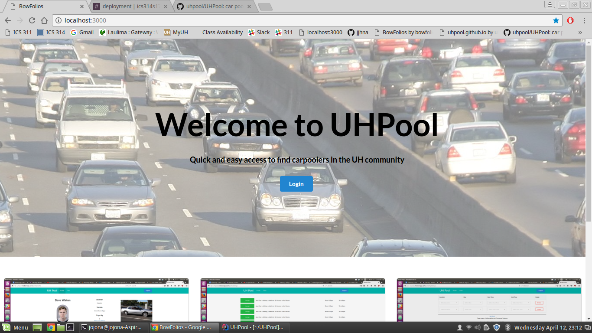
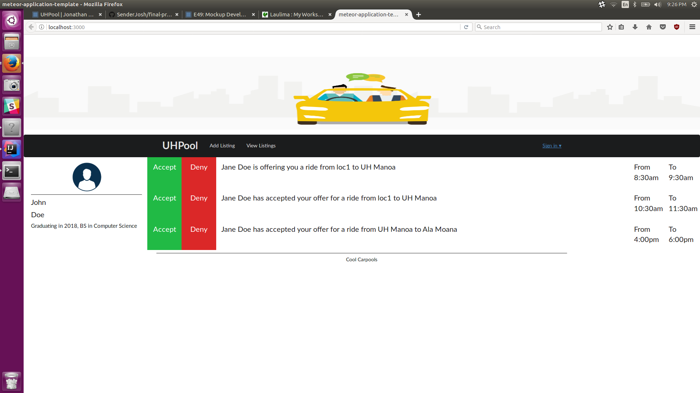
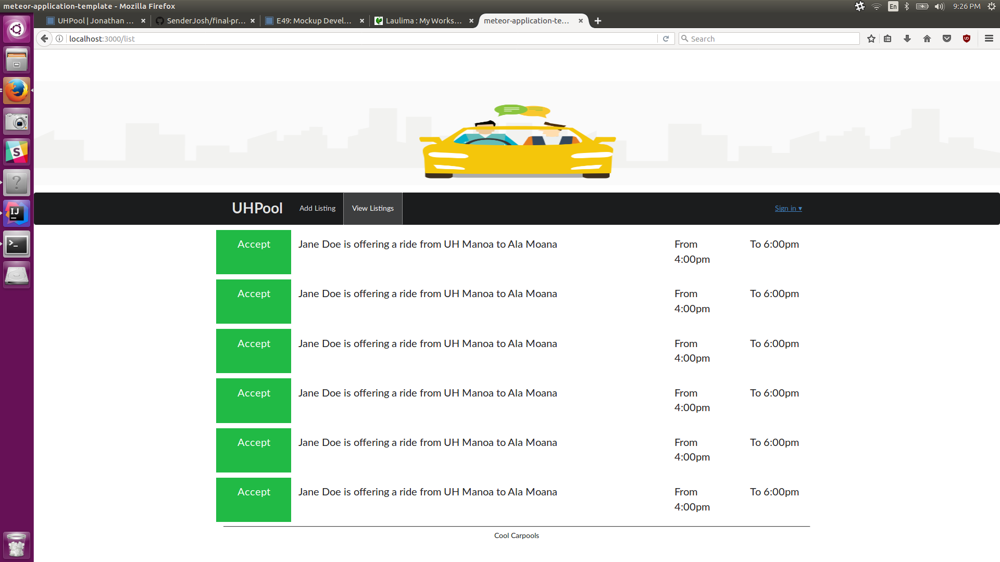
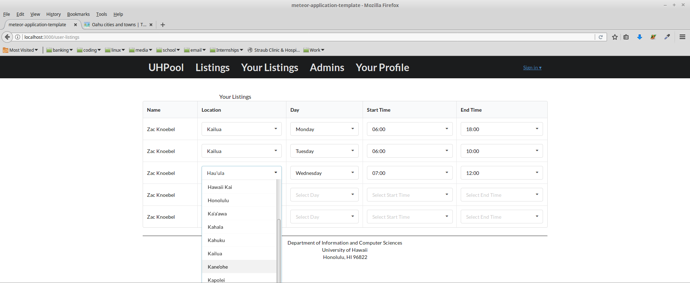

https://github.com/uhpool/UHPool/projects/1

### HACC 2017

For Milestone 1 five mockup pages were created for the project. The goal of milestone 1 was to create mockups of our app using the meteor app. The site allowed people to log in using their UH account however a lot of the functions in the website weren't fully operational. Milestone 1 started on April 5th, 2017 and ended on April 13th, 2017. 


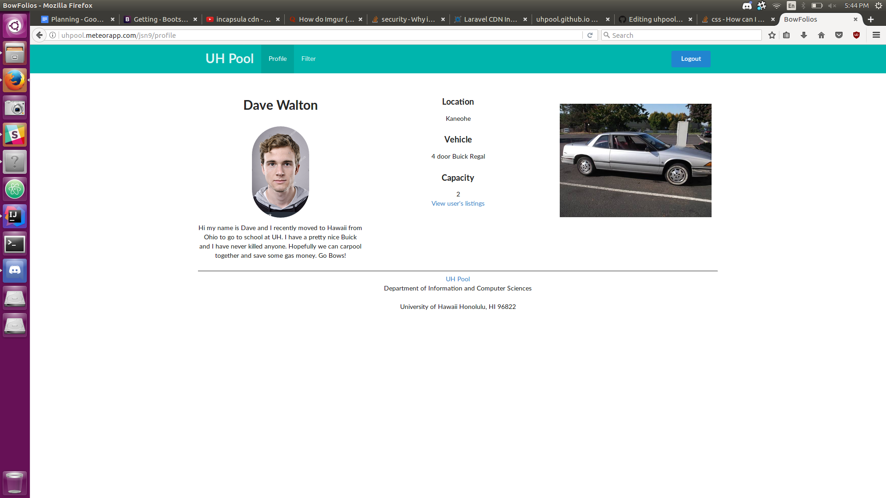
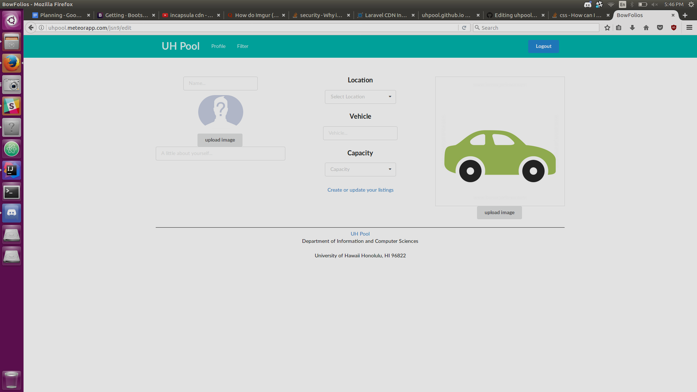

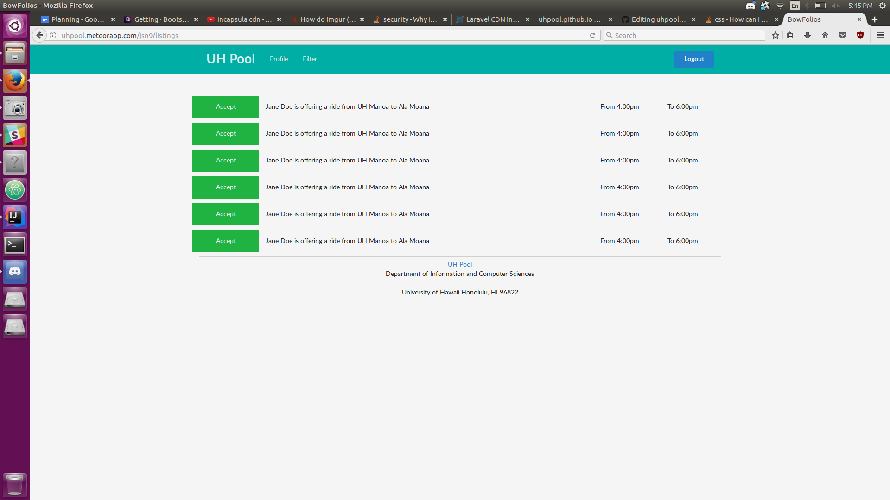

HACC 2017:
<a href="https://github.com/uhpool/UHPool/projects/1"><i class="large github icon"></i>Milestone Project 1</a>


Milestone 1:

<a href="https://github.com/uhpool/UHPool/projects/2"><i class="large github icon"></i>Milestone Project 2</a>


Network:


### Milestone 1
For Milestone 2 additional fixes were added to the project, the landing page images were updated, created schema for user and listing page, connected various pages to the database, created a user and developer guide and created a footer and header.
Milestone 2 started on April 13th, 2017 and ended on April 27, 2017

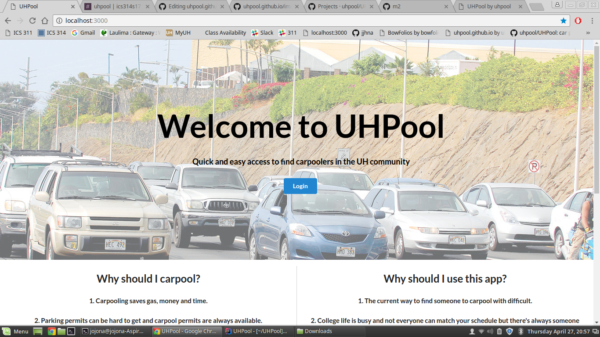
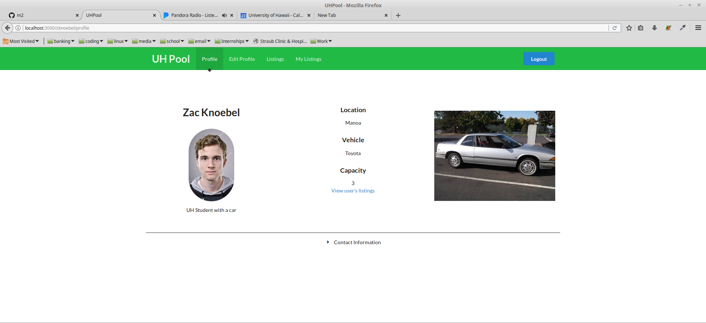
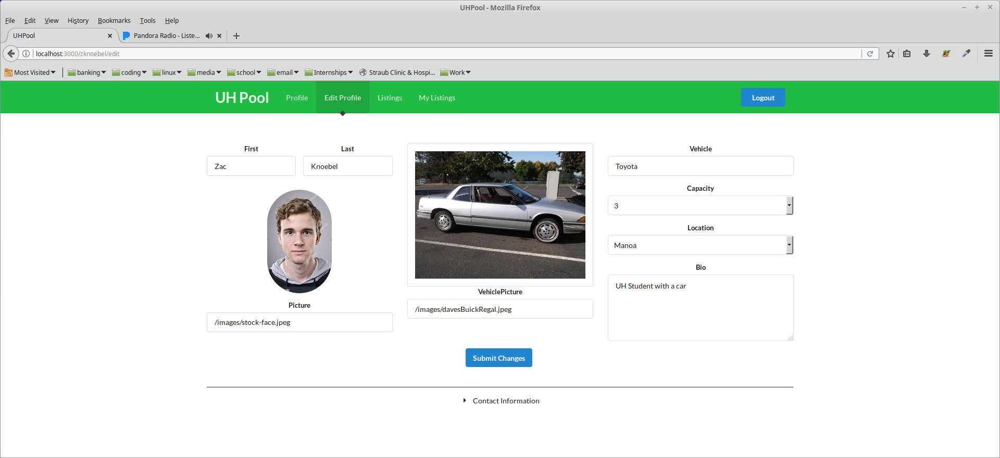
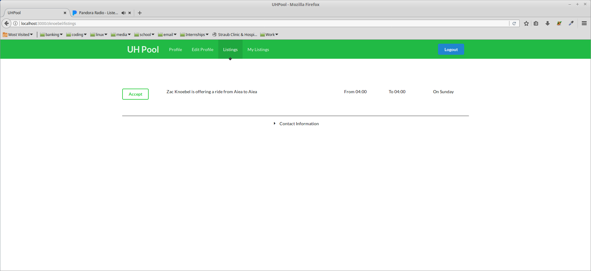
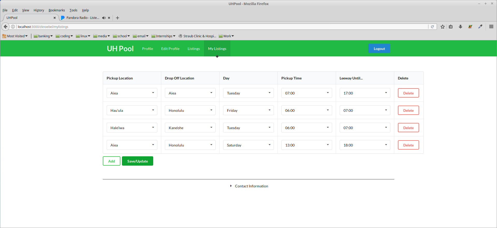

Milestone 1:
<a href="https://github.com/uhpool/UHPool/projects/2"><i class="large github icon"></i>Milestone Project 2</a>


Milestone 2:
<a href="https://github.com/uhpool/UHPool/projects/3"><i class="large github icon"></i>Milestone Project 3</a>


Network: 


Current website or app is accessible on: uhpool.meteorapp.com

### Milestone 2
For Milestone 2 additional fixes were added to the project, the login page was created, updated schema for user and listing page, connected various pages to the database, created the initial user study, fixes were also made for the listing and mylisting page.
Milestone 2 started on April 27th, 2017 and ended on May 09th, 2017

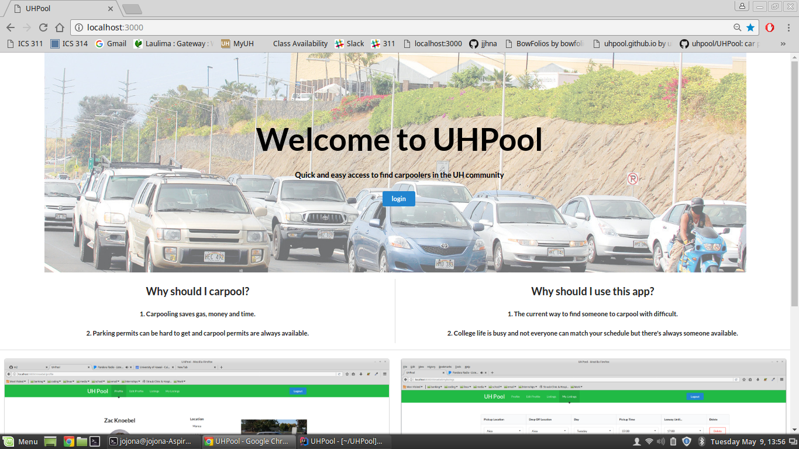
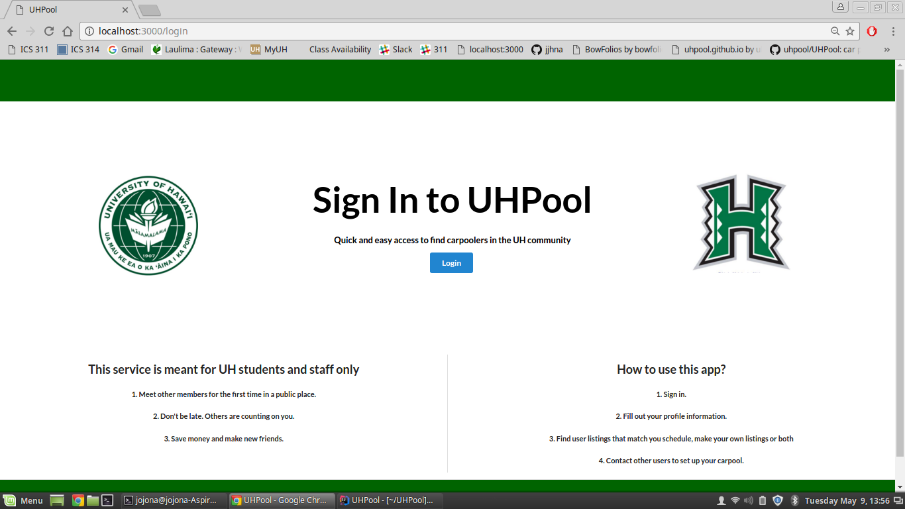

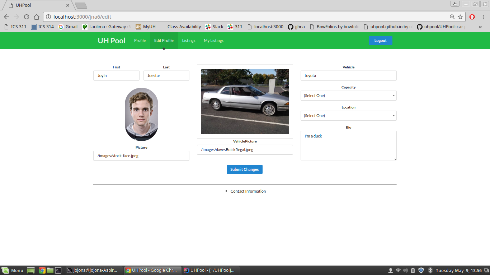
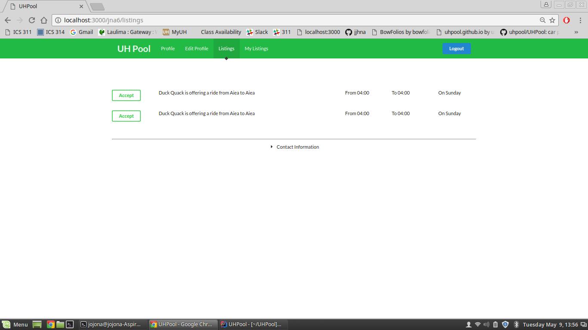
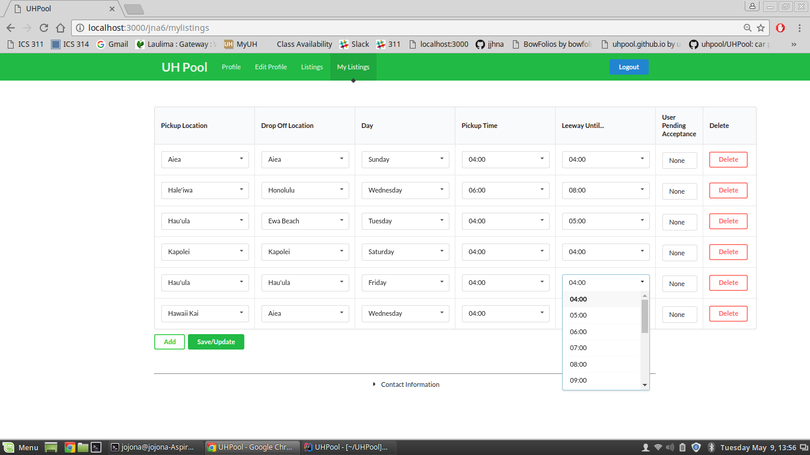

Milestone 2:
<a href="https://github.com/uhpool/UHPool/projects/3"><i class="large github icon"></i>Milestone Project 3</a>


Network: 


### Initial User Study

We used an online user study survey to find what people thought of our app @ https://goo.gl/forms/dKtHRmHfRl8KPUMC3

So far as of May only 5 participants tested our app and filled out the survey. After reviewing the results, we realized that there was one joker who gave us odd responses, however we did take into consideration that at least one or two people would fool around. 

Participants could only fill out the form if they tested the app and used their UH google account to log in and take the survey. Each participant could only fill out the survey once. 

Would you use this app if you carpooled? 

Out of 5 of the participants only one said no. So, this states that at least one person has either a better carpool app to use or wouldn't use an app to find someone to carpool with.


We're happy to announce that all five participants would recommend the app to others.


What did you find good about the app? 

Apparently, our general functions and UI interface was easy to use. Someone also just liked the idea of using a carpool app.


What did you find bad about the app? 

One participant stated that "I don't want to meet random people," it's hard to state if they were serious or not however our initial concept of creating this app is to find "someone" to carpool with. If we could easily find a friend or family member to carpool with we wouldn't have created this app in the first place. 

Another participant stated that the landing page background isn't too aesthetically appealing. After thinking about it, I could understand where this person was talking about. Having a background of traffic isn't a pretty sight, something like the picture of the campus of UH. 

"Nothing works yet", and "Needs some minor improvements on other functions", unfortunately this is a bit too vague on what parts the participant is talking about. 


What would you include in the app?

Participates stated they would prefer to include more images or a GPS or google map in the app. 


What would you remove from the app?

It looks like a lot of participates were confused by this question and one joker replied "everything".


In between one to five, one being "I would rather use Uber" and 5 being "I would download it in a heartbeat". About 60% (3) of the participants stated that they would rate the app a 4/5. One participant gave it a 3 and another participant gave it a 5. This shows overall at least all 5 participants enjoyed something from the app. 


We're happy that most the participants enjoyed using the app. However, we did note that next time we should improve the aesthetics such as the background image and try to include a GPS or map to help find routes and locations. 

### Conclusion

We could successfully launch our app. However, there were some stuff that we weren't unable to implement into our app. 
Such as the beyond the basics:
- Support reviews of other users, for any previous negative experience with a certain user (Star or thumbs up or down rating).
- A filter system for number of occupants their vehicle can hold, city, and school schedule.
- Email and website system to notify any users of inquires or matches.

We were so focused on just getting our app to work that we simply did not have the time to implement these specific features into the app. In the end the most important thing to have was an app or website that worked and that's what we accomplished. 

Things that we improved on in this project:
- Teamwork, we all gained each other’s trust and worked together as one group.
- Knowledge and improvement on using Meteor and IntelliJ.

Things we could improve on:
- Getting together, we slowly got together less after we finished milestone 2.
- Having a stronger plan, we should've perfected the important stuff first like the landing or listing page before trying to add a search function or automatic email updates.

