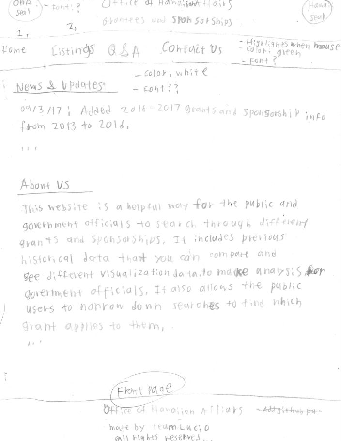
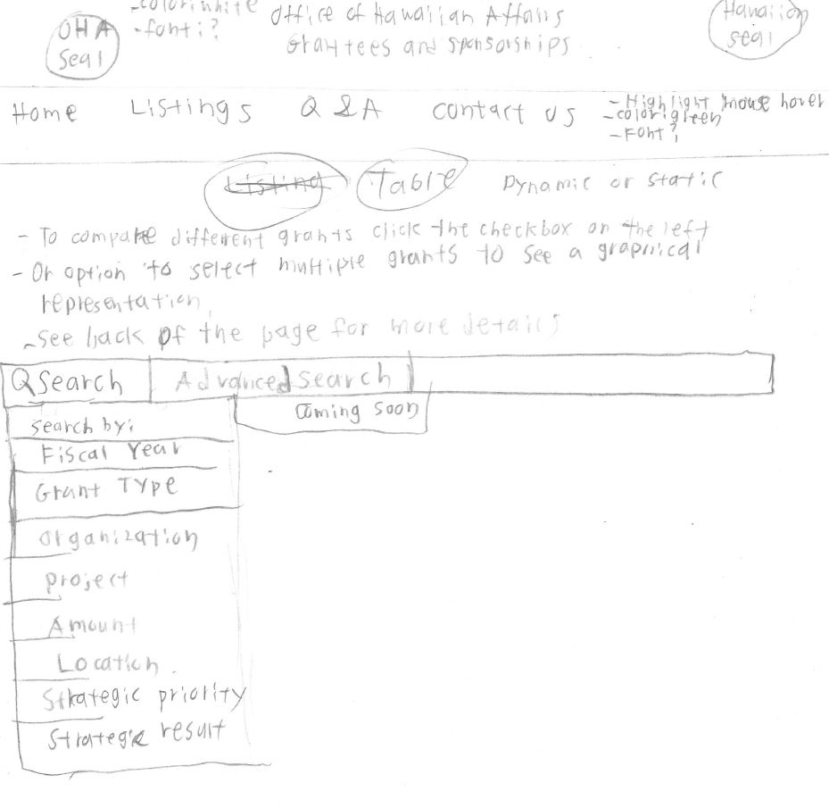
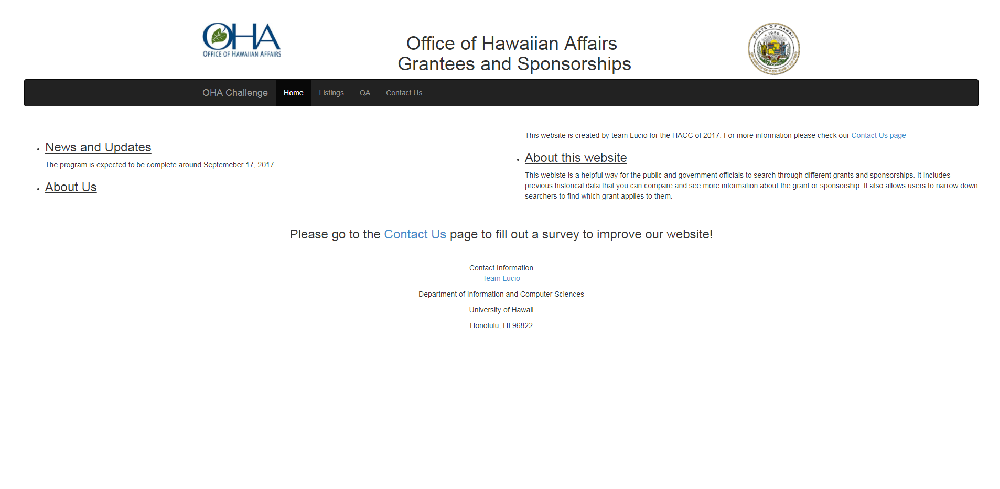
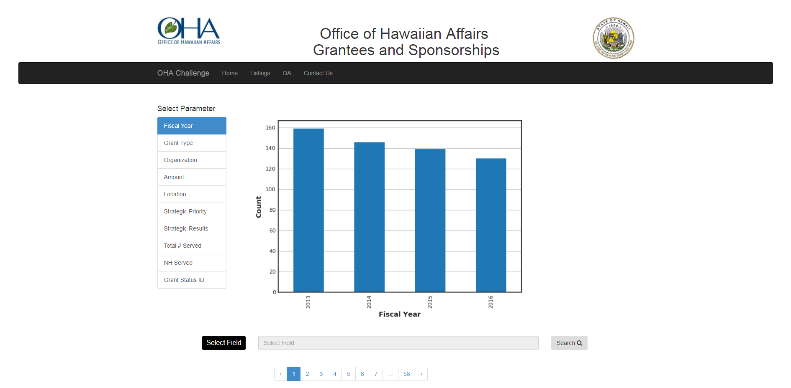
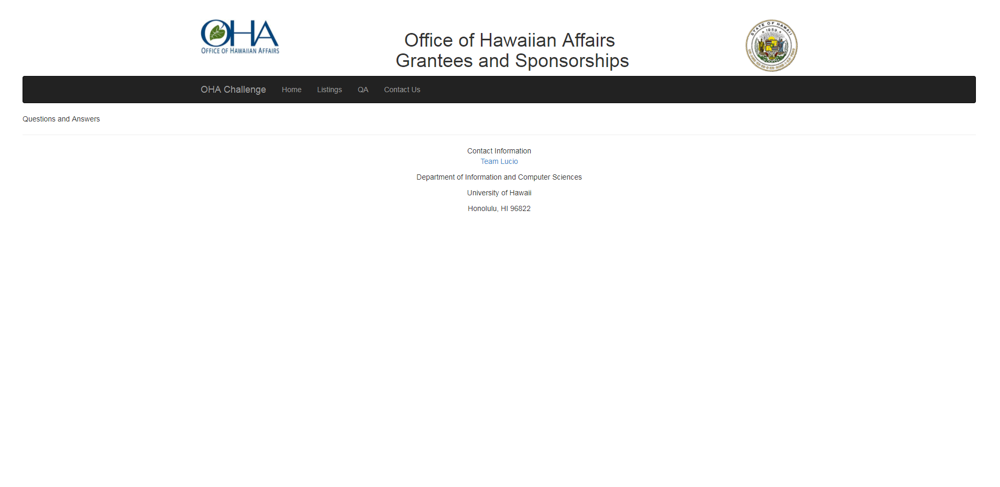
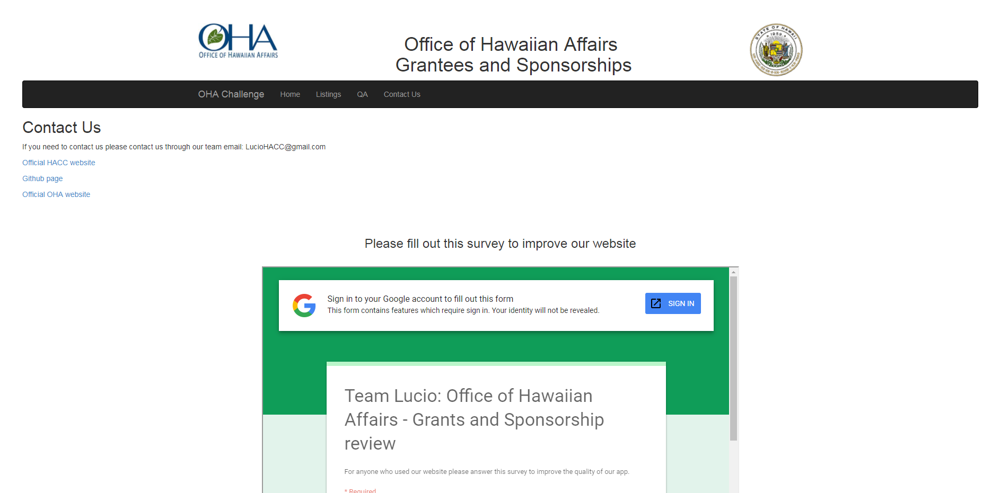
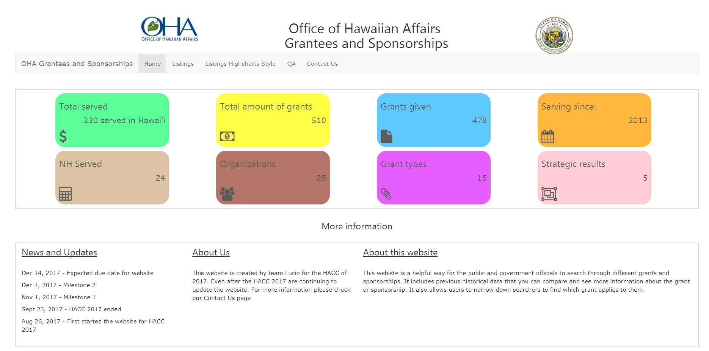
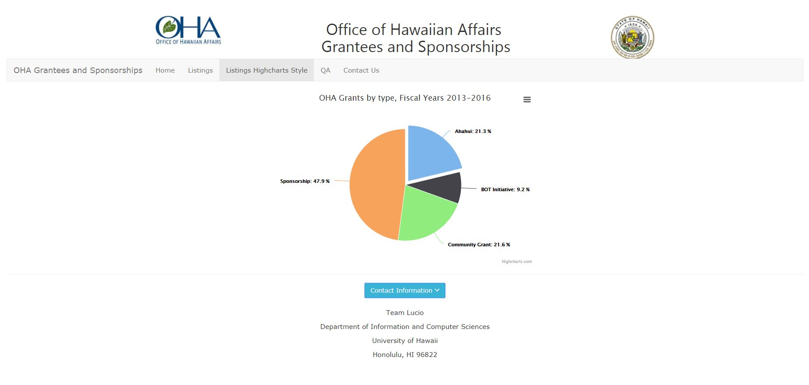
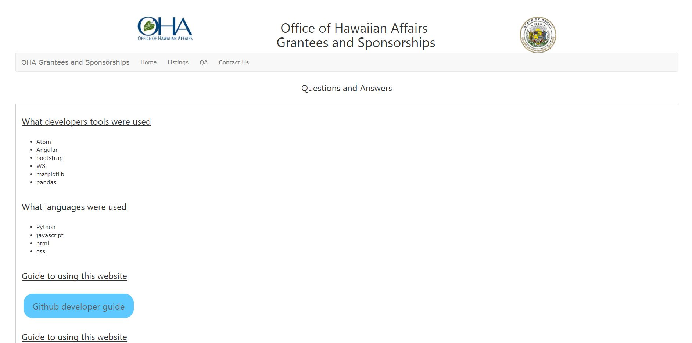
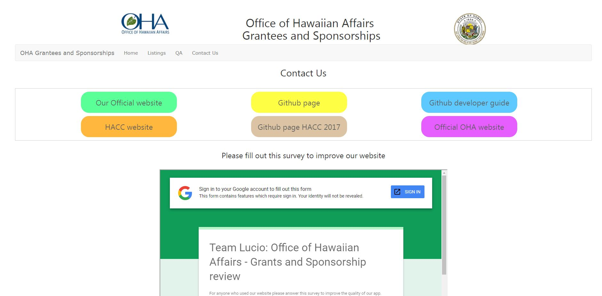

## Welcome to Da OHA Website

<a href="https://ohagrants.herokuapp.com/"><i class="large github icon"></i>OHA website</a>

# Table of contents

* [Overview: OHA website](#overview-OHA-Website)
  * [Walkthrough for OHA website](#walkthrough-OHA-Website)
* [Installation](#installation)
  * [Matplotlib and Highcharts](#matplotlib-and-highcharts)
  * [Branches](#branches)
  * [Heroku Website](#heroku-website)
* [Application design](#application-design)
  * [Directory structure](#directory-structure)
  * [Naming conventions](#naming-conventions)
  * [Routing](#routing)
  * [Survey](#survey)
* [Development history](#development-history)
  * [Initial Mockup Pages](#initial-mockup-pages)
  * [HACC 2017](#hacc-2017)
  * [Milestone 1](#milestone-1)
* [Personal-Professional-Portfolios](#personal-professional-portfolios)

### Overview OHA Website

### Walkthrough OHA Website

Access the website through: https://ohagrants.herokuapp.com/

OHA website is a angular app that allows the community and government officials to gain access to grants and scholarships for Hawaiian descendants. 
When first accessing th OHA website, everyone will be greeted by the landing page showing any news and updates. It then explains about our team and the website. 

Landing Page:


Listing Page:


Listing Page with Highcharts:


The listing page shows all the grants and scholarships in a list. It also allows the user to filter out and search through all the grants and show data analysis for the selected amount of grants and scholarships. 

QA Page:


Answers any pages that a user may have, plan to include tutorial videos or images in the near future.

Contact Us page:


Includes how to contact our team and it also includes a google survey form that users can fill out to give back their experience on the website.

### Installation

Optional, [install Atom](https://atom.io/).

First, [install Angular](https://angular.io/guide/quickstart).

Second, [download a copy of Lucio](https://github.com/ICS491TeamLucio/ICS491Lucio.git), or clone it using git.
  
Third, [install Flask](http://flask.pocoo.org/)

Please note you may have to install [the latest version of python](https://www.python.org/downloads/).

If all goes well, the application will appear at [http://localhost:3000](http://localhost:3000) or whatever default server that will be printed onto the screen. 

### Matplotlib and Highcharts

To install Highcharts a charting library:

First, [install Highcharts](https://www.highcharts.com/docs/getting-started/installation) download or somehow include the library files into the program.

Then for the head portion, import two .js files from the highcharts library, have one .js file be the base for highcharts and the other .js file to export the charts to a .png file. 

After that make the div in your code to specify the size of the chart and write out the chart code as a script in Javascript text.

To install Matploblib, a python 2D plotting library:

First, [install Matplotlib](https://matplotlib.org/users/installing.html) download or somehow include the library files into the program, the best way to do this is to build it on the OS that you have. 

Then using the information that you have from the excel file that you have converted into a cvc file. Use that information to fill up the data for the plotting library. 

### Branches

When creating a new branch for the project use issue-XX naming conventions. This prevents people from working on the master branch to prevent any future issues. Each issue is to work on different issues or problems that require attention such as "working on the landing page".

```
$ git checkout -b issue-XX
```

Try to avoid using the master branch as it is the primary focus that the app will run on.

To change branches:

```
$ git checkout [issue-XX or master]
```

Make sure to do:

```
$ git pull
```

in the master branch before adding or pushing any code to github. This prevents stepping on peoples toes or overriding other people’s codes that they worked on earlier which creates tension and problems. 

Lastly when pushing or pulling from github, merging with the master is required before pushing to github and merging with an issue is required if someone made a change to the master branch. 

```
$ git merge [master -Say if your current branch is issue-XX]
```

### Heroku Website

To use and make a meteor app website, first create an account on the [Heroku website](https://www.heroku.com/) After creating an account, you should have one website that you can deploy for free.

For better instructions please follow this [website](https://progblog.io/How-to-deploy-a-Flask-App-to-Heroku/).

You should then be able to access the website online on: https://nameofapp.herokuapp.com/

### Application Design

### Directory structure

The top-level directory structure contains:

```
src/        # holds the Angular application sources
.gitignore  # doesn't commit .DS_Store, .htaccess, *.pyc
```
However, we will be focusing heavily on the src folder that contains nearly 90% of the file contents. Each directory has its own sub-index that shows all the files in that directory which will be further explained in "Import conventions".

The src/ directory has this top-level structure:

```  
data/
  OHA Test Data Grant_2013_2014_2015_2016_Table.xlsx # function to parse excel file           
  
static/
  bower_components/  # bootstrap, angular ui, suave ui, etc.
  components/        # backend for the listing and visualizers
  css/               # style.css
  Highcharts-6.0.2/  # contains all the information for the highcharts charting library
    code/          # contains the js and css files
    examples/      # contains the index.htm files for the examples
    graphics/      # contains the images used by highcharts
  images/            # contains all the images used for the site
  js/                # javascript
    app.js/        # javascript for the app
    listing.js/    # javascript for the listing page
    route.js/      # route that connects each webpage to each other

templates/
  contactus.html/	# contact us page
  index.html/	    # landing page
  listings.html/	 # listing page
  qa.html/	       # QA page
     
app.py/           # impoty os - needed for Flask
graph.png/        # generate plot as image passable to frontend
parse_to_json.py/ # used to parse information from excel to data
test.html/        # generate plot as image passable to frontend
tests.py/         # generate plot as image passable to frontend
```

### Naming conventions

This system adopts the following naming conventions:

  * Files and directories are named in all lowercase, with words separated by hyphens. Example: accounts-config.js
  * "Global" JavaScript variables (such as collections) are capitalized. Example: Profiles.
  * Other JavaScript variables are camel-case. Example: collectionList.
  * Templates representing pages are capitalized, with words separated by underscores. Example: Directory_Page. The files for this template are lower case, with hyphens rather than underscore. Example: directory-page.html, directory-page.js.
  * Routes to pages are named the same as their corresponding page. Example: Directory_Page.

### Survey

We used an online survey to find suggestions and our target area for people to use our app @ https://goo.gl/forms/UvFFHUN7N2ZltB4z1


## Development-History

### Initial Mockup Pages

Our initial mockup pages before starting our HACC 2017, it contains the brainstorm and paper prototype of our website.





## HACC 2017

All of this was from our DevPost page for the HACC 2017:

Inspiration:

This was our first hackathon for all of us so we wanted to gain experience in the HACC, so even if we didn't win, we'll still get experience which can be more valuable than the prize. Our team name: Lucio is comes from the game Overwatch that one of our teammate loves to play and that no one else had a better name to come up with. 

What it does:

It's supposed to show all the grants from 2013-2016 in a table that can be filtered with a search bar and a graphical representation (pie chart, bar graph,...) will also appear to give more useful data on the grants. Such as the amount of grants that was awarded in 2013 or the type of different grants that are around one hundred thousand dollars. This allows any users such as a government official get a better idea on the grants being issued or to a grant recipient trying to find which grant fits their needs.  

How we built it:

For our editor we used Atom, for our front-end and back-end we used Angular, for our web framework we used Flask and for our deployment we used Heroku. We mostly used HTML, Python, and other basic languages used to build a website.

Challenges we ran into:

A lot of the team was busy with school and work so it was hard for everyone to get together to work on the project. Some folks were so busy that they had little or no time to do any work on the project which cut down our manpower. Some of the smaller challenges that we faced were implementing some of our ideas into the project such as creating analysis tools or even deploying the project on Heroku. Other challenges was the understanding of using angular and Flask. For example a lot of us were unfamiliar with using Angular however fortunately we had one teammate who was a professional at using Angular. For Flask we were unable to solve the problem where we couldn't get the website to automatically refresh after we made some changes to our project. 

Accomplishments that we are proud of:

Being able to complete a functional website by the due date, there were a couple of times where we thought we wouldn't be able to make the deadline due to some difficulties. However we're proud to meet the requirements of having a functional website such as our search engine through the multiple grants in the table and the analysis tools that display useful information to the user. We know that our project may be limited and unappealing to the eyes but we're proud of our project. 

What we learned:

That college students are busy with school, work and life. We had a hard time trying to balance between schedules and this hackathon. In fact we had some folks that were unable to meet up until a week after the first check in. However some of us did learn a lot about project management, new applications, new software's and a good refresher for some of us. For the most part a lot of us learned about tools and languages that we didn't know about until the hackathon. Such as Angular, Flask and even Python for some of us. Other new things that we learned was how to create analysis tools such as pie charts or bar graphs for our database in our website. 

What is next for Lucio:

Learning from our mistakes to improve ourselves in the future or the next HACC. We do have two people that plan on continuing this project after the HACC. We're hoping to expand on this project and implement ideas that we weren't able to be completed during the HACC. Such as adding more information on the grants that are being issued, tutorial videos that explain how the website work and making the overall appearance of the website better. 

### HACC 2017:

<a href="https://devpost.com/software/lucio">HACC 2017 Devpost</a>


<a href="https://github.com/ohagrantwebsite/ohagrantwebsite/projects/1"><i class="large github icon"></i>Milestone Project 1</a>


Network:


HACC 2017 began on August 26th, 2017 and ended on September 23rd, 2017






### Milestone 1
For Milestone 1 additional fixes were added to the project, the front page images were updated, cards were added to the front page, the design of the website bar, footer and headers were updated. The QA page was also updated and the contact us page was updated into cards. A new platform for the backend called highcharts was also implemented instead of the matplotlib for the listing page. However we did had to make some changes to the issues since we realized that a tutorial guide would be better made after finishing the backend of the project and we decided to use a new platform called highcharts instead of matplotlib. So we moved the tutorial guide into the 2nd milestone instead of the first one. 
Milestone 1 started on September 23, 2017 and ended on November 1, 2017







Milestone 1:
<a href="https://github.com/ohagrantwebsite/ohagrantwebsite/projects/1"><i class="large github icon"></i>Milestone Project 1</a>


Milestone 2:
<a href="https://github.com/ohagrantwebsite/ohagrantwebsite/projects/2"><i class="large github icon"></i>Milestone Project 2</a>


Network: 


Current website or app is accessible on: https://oha-grant-listings.herokuapp.com/

Whats planed for the next milestone: 

Now that the front end of the website is a lot better we will now start working on the back end portion of the website. So we will focus more on the listing page and continue to implement highcharts and add some functions such as cross referencing and drill down for the listing page. Finally we hope to add a tutorial video and testing from people at the ICS space before December 1, 2017. 

## Personal Professional Portfolios

Before we begin here's our personal professional portfolios:

<a href="https://jjhna.github.io/">Jonathan Na's professional portfolio

<a href="">Vincent professional portfolio
